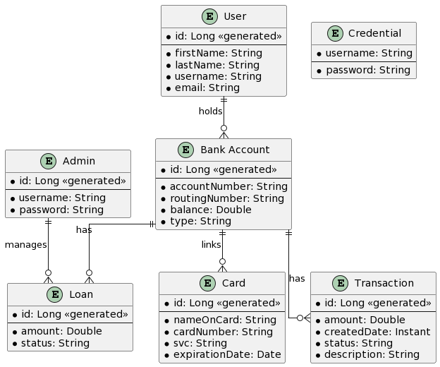
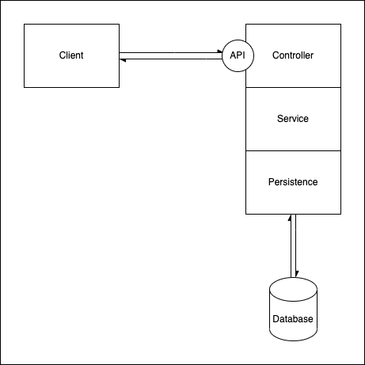

# RevPay

## Overview

The RevPay project aims to develop a secure, user-friendly, and versatile financial application for both personal and business users. The core functionalities for personal accounts include sending or requesting money, adding debit cards, and viewing the transaction history. Business accounts allow users to apply for loans.

## Functionalities

- Users can register and create a new account.
- Users can login to the account.
- Users can send money by username or email.
- Users can request money by username or email.
- Users can add debit cards to their account using card details.
- Users can view their transaction history.
- Every transaction being made will notify both participants via email.
- An email notification is sent when somebody requests money.
- Users can apply for a business loan via their business accounts.
- Admin can open an account for users.
- Admin can approve loans.

## Technologies

|                       | Technology       |
| --------------------- | ---------------- |
| Front-end             | Angular          |
| Bank-end              | Spring           |
| Database              | PostgresQL       |
| Programming languages | Java, TypeScript |
| CSS                   | Tailwind CSS     |

## Supporting Technologies

- DBeaver
- Postman
- Git & GitHub
- Maven
- NPM

## ERD Diagram

## Architecture Diagram

